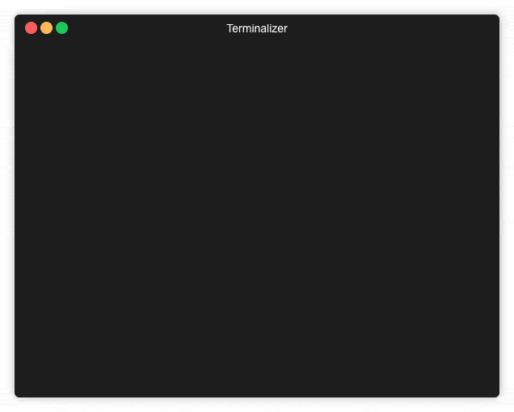

# demoshell

Tool for live presentations.
Executes scripts line by line.



## Install

go get -u github.com/alex-slynko/demoshell

or clone and run go install

## Usage

```bash
demoshell some-sh-file
```

It runs the script line by line.

## Differences from doitlive

Demoshell based on [doitlive programm](https://doitlive.readthedocs.io/en/stable/). It supports some of the tags provided by that application.

Unlike the doitlive demoshell:

- Prints the whole line at a time and executes the line by enter. It does not requires fake typing.
- It saves the environment variables from the result of the command and passes them through to the next command.
- It launches real bash session only.
- It prints comments as well.


## TODO

- Do not run multiple commands if enter is pressed multiple times